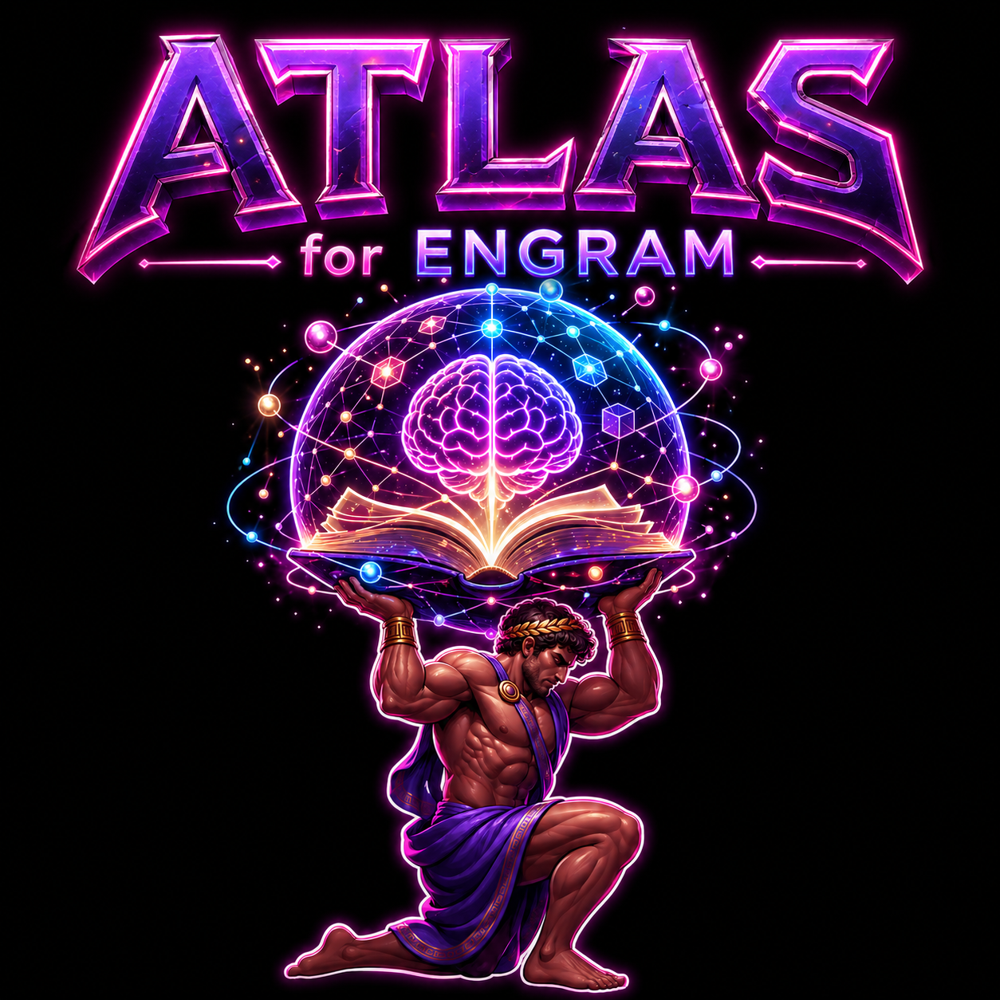

<div align="center">



<h1>atlas-for-engram</h1>

<p><strong>Atlas-pool injection + retrieval skills for engram. Bridges Obsidian Web Clipper raw clips to project-scoped engram memory.</strong></p>

<p>
<a href="https://github.com/Kirilgitlsiiejah/atlas-for-engram/releases"></a>
<a href="https://github.com/Kirilgitlsiiejah/atlas-for-engram/stargazers"></a>
<a href="LICENSE"></a>


</p>

</div>

---

## What It Does

This is NOT another AI tool installer. This is a **knowledge ingestion bridge** -- it takes the raw markdown clips your browser dumps into your vault and turns them into project-scoped, searchable engram observations with full CRUD, integrity checks, and an auto-generated browse index.

**Before**: "I clipped 200 articles to Obsidian, now they're rotting in a folder I never open."

**After**: Every clip is a `type=atlas` observation, indexed by project, separated from your own work in every `mem_search`, browsable from a generated `Atlas-Index.md`, and editable / deletable / lookup-able with a single skill invocation.

### 7 skills + 2 hooks

| Skill | Trigger | Purpose |
|---|---|---|
| `inject-atlas` | "inyectá al proyecto X la info de Y" | **CREATE** -- parse atlas-pool .md and save to engram as `type=atlas` |
| `atlas-edit` | "editá el atlas X" | **UPDATE** -- PATCH `/observations/{id}` with field=value pairs |
| `atlas-delete` | "borrá el atlas X" | **DELETE** -- individual + bulk + optional raw .md cleanup |
| `atlas-lookup` | "tengo atlas de URL X?" | **READ** -- cross-project URL search |
| `atlas-cleanup` | "atlas integrity check" | **INTEGRITY** -- orphans / dangling / duplicates / malformed report |
| `atlas-index` | "atlas index" | **BROWSE** -- regenerates `Atlas-Index.md` in vault root |
| `compare-with-atlas` | auto via PostToolUse hook | **READ** -- separates own_work vs atlas results in every `mem_search` |

> **Note**: This is a community / companion plugin for [engram](https://github.com/Gentleman-Programming/engram). It integrates with engram's HTTP API and follows engram's claude-code plugin conventions, but it is **not officially affiliated with, endorsed by, or maintained by the engram project**.

---

## Quick Start

### One-liner (recommended)

```bash
claude plugin marketplace add Kirilgitlsiiejah/atlas-for-engram && claude plugin install atlas@atlas-for-engram
```

The marketplace points at this repo's `.claude-plugin/marketplace.json`. Once installed, Claude Code resolves all skills, hooks, and scripts from `${CLAUDE_PLUGIN_ROOT}` automatically -- no manual file copies, no `settings.json` edits.

To update later:

```bash
claude plugin update atlas@atlas-for-engram
```

### After install: minimal setup

Once the plugin is installed, the SessionStart doctor runs on every session and tells you what's missing. Typical first-time setup:

| Step | What it does | When to re-run |
|---|---|---|
| `mkdir -p $HOME/vault/atlas-pool` | Creates the pool directory the doctor expects | First time on a new machine |
| Configure Web Clipper output to `atlas-pool/` | Routes browser clips to the pool | Once per browser |
| Run `/inject-atlas` on a clip | First end-to-end ingestion | Whenever you want to inject a new clip |

The doctor surfaces missing deps, an unreachable engram, or a missing `atlas-pool/` automatically -- you don't need to remember any of this.

---

## Install

### Recommended

```bash
claude plugin marketplace add Kirilgitlsiiejah/atlas-for-engram && claude plugin install atlas@atlas-for-engram
```

<details>
<summary><strong>Other install methods</strong> (two-step inspect)</summary>

#### Two-step install

If you want to inspect the marketplace before installing the plugin (security audit, version check, etc.):

```bash
claude plugin marketplace add Kirilgitlsiiejah/atlas-for-engram
# Inspect: cat ~/.claude/plugins/marketplaces/atlas-for-engram/.claude-plugin/marketplace.json
claude plugin install atlas@atlas-for-engram
```

</details>

---

## Architecture

```
Browser Web Clipper
        |
        v
   ${ATLAS_VAULT}/atlas-pool/<slug>.md  (raw markdown, no project)
        |  inject-atlas (manual trigger)
        v
   engram type=atlas, project=<auto-detected from git>
        |
        +--> Atlas-Index.md  (auto-regen on every inject)
        |
        +--> mem_search → compare-with-atlas hook → own_work vs atlas
        |
        v
   Browse / retrieve from any markdown editor or claude-code session
```

The plugin lives entirely under `${CLAUDE_PLUGIN_ROOT}` once installed:

```
${CLAUDE_PLUGIN_ROOT}/
├── .claude-plugin/
│   ├── plugin.json
│   └── marketplace.json
├── hooks/
│   └── hooks.json          # PostToolUse + SessionStart registration
├── scripts/
│   ├── _helpers.sh         # detect_project / resolve_project / detect_vault cascade
│   ├── _doctor.sh          # healthcheck (6 checks)
│   └── session-start.sh    # SessionStart shim → calls _doctor.sh
└── skills/
    ├── inject-atlas/
    ├── atlas-edit/
    ├── atlas-delete/
    ├── atlas-lookup/
    ├── atlas-cleanup/
    ├── atlas-index/
    └── compare-with-atlas/
```

Project resolution: same algorithm as engram core -- git remote → git root basename → cwd basename → fallback `dev`. Override per-invocation by passing `project` explicitly.

---

## Key Features You Should Know About

### Auto-separated search results (PostToolUse hook)

Every `mem_search` you make in a project that has atlas observations gets automatically split into two buckets: **own_work** (your decisions, bugs, sessions) and **atlas** (clipped articles, papers, references). You don't trigger this -- the hook fires after every search, reads the JSON tool_response on stdin, and emits an `additionalContext` payload so the agent presents results with provenance. Silent if no atlas results.

Matcher: `mcp__plugin_engram_engram__mem_search`. Registered in `hooks/hooks.json`.

### SessionStart doctor (self-check)

Every session and every `/clear` runs `scripts/_doctor.sh` with a 3s timeout. Six checks, each <100ms in a healthy env:

1. **engram reachable** -- `GET http://${ENGRAM_HOST}/health` with 1s timeout
2. **deps present** -- `jq`, `curl`, `rg`, `fd` on PATH
3. **vault resolution report** -- always reports the resolved level (L1..L5) and path, even when healthy, via `additionalContext` (so you can see which cascade branch fired)
4. **L5-fallback missing** -- if the cascade fell to `$HOME/vault` (L5) AND that directory does not exist, surface a remediation hint
5. **vault layout** -- `<resolved-vault>/atlas-pool/` exists (resolved via the [vault cascade](#vault-resolution))
6. **no legacy hook** -- `~/.claude/settings.json` does NOT contain a PostToolUse hook for `compare-with-atlas` (would double-fire alongside the native plugin)

Exit codes: `0` always (never blocks session start). Stdout empty → silent OK. Stdout JSON → warnings surfaced as `additionalContext` for the agent.

Example output (unhealthy env):

```json
{
  "continue": true,
  "hookSpecificOutput": {
    "hookEventName": "SessionStart",
    "additionalContext": "atlas-doctor:\n  - engram unreachable at http://127.0.0.1:7437\n  - missing commands: fd\n  - atlas-pool not found at /home/u/vault/atlas-pool\n"
  }
}
```

Run manually any time:

```bash
bash ${CLAUDE_PLUGIN_ROOT}/scripts/_doctor.sh
```

### Vault-agnostic ingestion

Built for Obsidian Web Clipper but the parser only assumes a markdown file with a YAML frontmatter and a body. Any tool that drops `.md` into `${ATLAS_VAULT:-$HOME/vault}/atlas-pool/` works (Logseq, Foam, Zettlr, raw curl). The injection skill auto-detects the engram project from your current git repo, so the same clip can land in different projects depending on where you trigger it from.

---

## Configuration

| Env var | Default | Purpose |
|---|---|---|
| `ENGRAM_HOST` | `http://127.0.0.1:7437` | engram HTTP API URL |
| `ENGRAM_PORT` | `7437` | shorthand if `HOST` not set |
| `ATLAS_VAULT` | (unset; cascade resolves) | canonical vault root (parent of `atlas-pool/`). Replaces `VAULT_ROOT`. |
| `VAULT_ROOT` | (unset; legacy) | **deprecated** -- still respected for one release with a one-shot warning. Migrate to `ATLAS_VAULT`. |
| `ATLAS_PROJECTS` | auto-detected | comma-separated list for `atlas-cleanup` cross-project scan |
| `MOVE_RAW_AFTER_INJECT` | `false` | move `.md` to `atlas-pool/injected/` after inject |
| `ATLAS_EDIT_CONFIRM_TYPE_CHANGE` | `false` | required `=yes` to change type of an atlas obs |

---

## Vault Resolution

Cada skill que toca el `atlas-pool/` resuelve el vault por una **cascada de 5 niveles**. Gana el primero que matchea -- los demás se ignoran.

| Nivel | Fuente                                          | Cuándo usarlo                          |
|-------|-------------------------------------------------|-----------------------------------------|
| **L1** | flag `--vault <path>` pasado al script         | Override puntual sin ensuciar env vars |
| **L2** | env var `$ATLAS_VAULT`                          | Default canónico para tu shell         |
| **L3** | env var `$VAULT_ROOT` (**legacy, deprecated**)  | Compat con setups previos -- migrá a `ATLAS_VAULT` |
| **L4** | walk-up desde `$PWD` buscando un marker         | Working tree con vault auto-detectado  |
| **L5** | fallback `$HOME/vault`                          | Si todo lo anterior falla              |

### Markers de walk-up (L4)

El walk-up parte de `$PWD` y sube directorio por directorio buscando alguno de estos:

- **`.obsidian/`** -- directorio (es el marker nativo de Obsidian, no lo creás vos manualmente)
- **`.atlas-pool`** -- archivo regular vacío (lo creás vos con `touch .atlas-pool` en la raíz del vault)

> **Importante**: `.atlas-pool` tiene que ser un **archivo**, no un directorio. Si existe `.atlas-pool/` como directorio (suele pasar por confusión con la carpeta `atlas-pool/` que sí es un dir), el walk-up lo **ignora** y sigue subiendo.

Termination guards: el walk-up para automáticamente al llegar a `/` (POSIX), un drive root tipo `/c` o `C:/` (Windows / Git Bash), o un UNC root tipo `//host/share`. También hay un cap defensivo de 64 iteraciones.

### Migración desde `VAULT_ROOT`

Si tenías esto en tu shellrc:

```bash
export VAULT_ROOT="$HOME/Documents/vault"
```

Cambialo a:

```bash
export ATLAS_VAULT="$HOME/Documents/vault"
```

`VAULT_ROOT` sigue funcionando -- emite un warning una sola vez por sesión (`warning: $VAULT_ROOT is deprecated; use $ATLAS_VAULT instead`) y se resuelve igual. Para silenciarlo: migrá a `ATLAS_VAULT`.

### Cómo saber qué nivel se está usando

El doctor (SessionStart) reporta el nivel resuelto en cada sesión:

```
atlas-doctor:
  - vault: L4 (walk-up .obsidian) -> /home/u/projects/notes
```

Cuando el doctor cae a L5 y el path no existe, agrega una pista de remediación:

```
  - vault path /home/u/vault does not exist -- set $ATLAS_VAULT, place .atlas-pool marker, or create the dir
```

---

## Troubleshooting

**engram unreachable**: start engram (`engram serve` or however you run it) and re-check with `curl -sf http://127.0.0.1:7437/health`. Override host with `ENGRAM_HOST=host:port`.

**missing commands**: install whichever the doctor flagged. On Windows Git Bash use scoop / chocolatey. On macOS `brew install jq curl ripgrep fd`. On Linux use your package manager -- the names are usually `jq curl ripgrep fd-find`.

**atlas-pool not found**: create it (`mkdir -p $HOME/vault/atlas-pool`) and point your Web Clipper output there. Override the parent with `ATLAS_VAULT=/path/to/vault` (or set up walk-up by placing a `.atlas-pool` empty file at the vault root — see [Vault Resolution](#vault-resolution)).

---

## Compatibility

- **engram**: >= v1.13.0 (uses `/observations`, `/observations/recent`, `/observations/{id}` PATCH/DELETE, `/search`)
- **Claude Code**: any version supporting native plugins + skills + PostToolUse + SessionStart hooks
- **OS**: Windows (Git Bash), macOS, Linux
- **Deps**: `bash`, `jq`, `curl`, `rg` (ripgrep), `fd`

---

## CI

Cuatro jobs corren en cada push y PR a `main`:

- **shellcheck**: lintea bash via `ludeeus/action-shellcheck` pinned a SHA exacto. Severity `warning`. Config: `.shellcheckrc` en root.
- **validate-json**: `jq -e .` sobre `plugin.json`, `marketplace.json`, `hooks.json`.
- **bash-syntax**: `bash -n` sobre todos los `.sh`.
- **version-sync**: chequea que `VERSION` y `plugin.json#version` no estén desincronizados.

### CI failure alerts

Si algún job de CI falla en push a `main`, el workflow `ci-alerts.yml` auto-crea (o comenta sobre la existente) una issue con label `ci-failure`. Notificación al maintainer vía GitHub. Idempotente por commit SHA: re-runs del mismo SHA agregan comentario, no duplican issue. Issues NO se auto-cierran al fixearse — cerrá manualmente como audit trail. PR failures NO disparan alerta (ya son visibles en la UI del PR).

### shellcheck pin policy

El action `ludeeus/action-shellcheck` se pinea a SHA exacto (no tag). Razón: prevenir upgrades silenciosos del action o de la versión de shellcheck que ese action incluye internamente.

**Cómo bumpear**:
1. Chequeá releases en https://github.com/ludeeus/action-shellcheck/releases
2. Resolvé el SHA del commit del release: `gh api repos/ludeeus/action-shellcheck/git/ref/tags/<TAG> --jq .object.sha`
3. Actualizá `.github/workflows/ci.yml` con el nuevo SHA + comment `# corresponds to <TAG>`
4. Abrí PR aislado con título `chore(ci): bump shellcheck action to <SHA>`
5. Si el bump introduce SC codes nuevos: triage en commit aparte dentro del mismo PR
6. Merge sólo si CI pasa verde

---

## Roadmap

See [issues](https://github.com/Kirilgitlsiiejah/atlas-for-engram/issues) for planned features and known limitations.

---

## Next Steps

- **Just installed?** Run `/inject-atlas` on any `.md` file in your `atlas-pool/` and watch the index regenerate.
- **Already have engram memories?** Your next `mem_search` will auto-split own_work vs atlas via the PostToolUse hook -- no config required.
- **Want integrity checks?** Run the `atlas-cleanup` skill after a few injection sessions to catch orphans, dangling refs, duplicates, and malformed observations.
- **Ready to contribute?** Check the [open issues](https://github.com/Kirilgitlsiiejah/atlas-for-engram/issues).

---

<div align="center">
<a href="LICENSE"></a>
</div>
